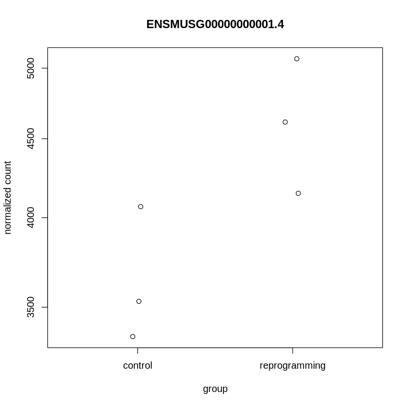

# hse21_hw3

Ссылка на 1 часть: [https://colab.research.google.com/drive/19O6sdnHVjBC3Na8NeyeZcbh2u3kbPYWp?usp=sharing](https://colab.research.google.com/drive/19O6sdnHVjBC3Na8NeyeZcbh2u3kbPYWp?usp=sharing)

Ссылка на часть с R: [https://colab.research.google.com/drive/10X7_12S413H2nZDPFoVMVzVTeMGlzM3Q?usp=sharing](https://colab.research.google.com/drive/10X7_12S413H2nZDPFoVMVzVTeMGlzM3Q?usp=sharing)

Я заметил, что я перепутал колонки в ALL.counts, поэтому я написал скрипт на питоне который все правит (`main.py` в папке `data/`).

Отчет fastq лежит в `multiqc_report.html`.

Графики для генов которые наиболее значимо поменяли свою экспрессию (55402, 55403, 5409, 265).

